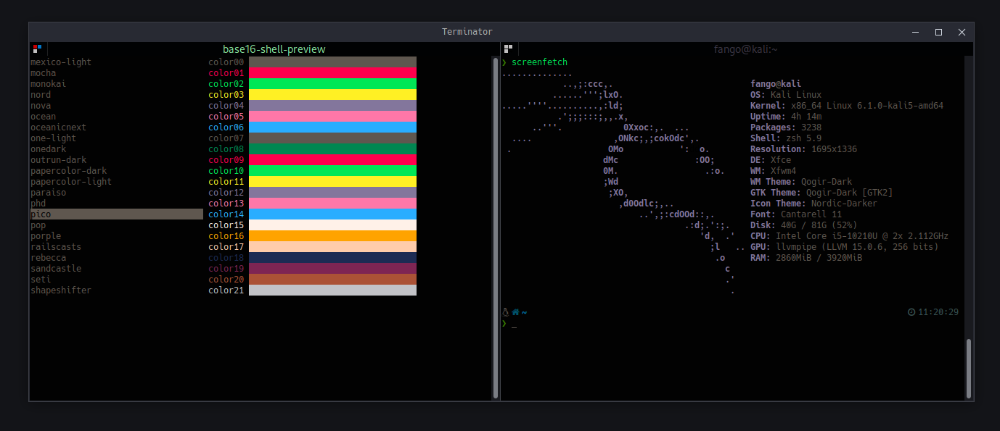

# dotfiles

A collection of my personal dotfiles.



## Install

TODO: add installation script

- Install any Nerd Font like [Hack NF](https://github.com/ryanoasis/nerd-fonts/blob/master/patched-fonts/Hack/Regular/complete/) for terminal icons ([Font manager](https://github.com/FontManager/font-manager))
- [Make ZSH default shell](https://github.com/ohmyzsh/ohmyzsh/wiki/Installing-ZSH) if not already
- [Oh My ZSH](https://ohmyz.sh/)
- [powerlevel10k](https://github.com/romkatv/powerlevel10k) Theme for Oh My ZSH
- [bat](https://github.com/sharkdp/bat) cat on steroids
- [lsd](https://github.com/Peltoche/lsd) ls on steroids

## Configuration

Clone this repository:

```shell
git clone https://github.com/dkadev/dotfiles.git ~/.dotfiles
```

### Using [GNU Stow](https://www.gnu.org/software/stow/) _(recommended)_

Install GNU Stow _(if not already installed)_

```markdown
Mac:      brew install stow
Ubuntu:   apt-get install stow
Fedora:   yum install stow
Arch:     pacman -S stow
```

Then simply use stow to install the dotfiles you want to use:

```shell
cd ~/.dotfiles
stow vim
stow tmux
```

### or Manual Installation

Create symbolic links for the configurations you want to use, e.g.:

```shell
ln -s ~/.dotfiles/vim/.vimrc ~/.vimrc
```

---

#### Additional configuration

Some of the configurations need additional setup or configuration. If that's the case you can find a `README.md` file in the application's directory. Make sure to take a look at it to see what else there is to do to make the configuration work on your system.
